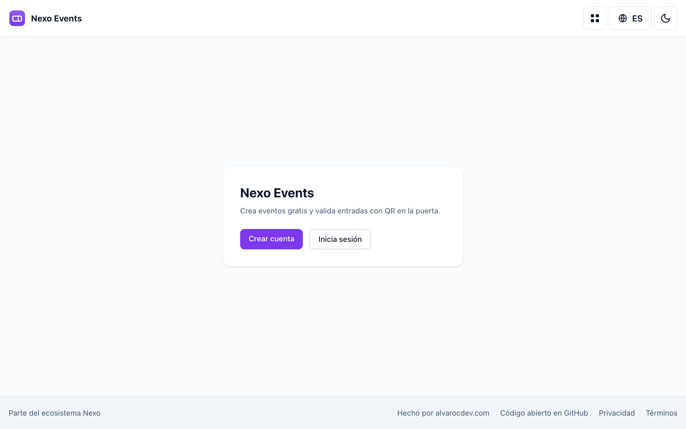
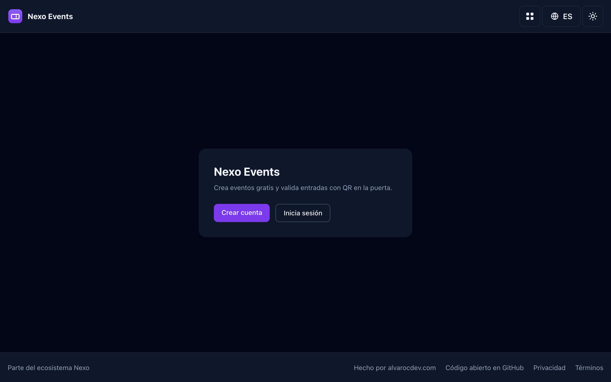

# Nexo Events

**Free event registration and QR tickets you host yourself — an open-source Eventbrite / Luma alternative for simple events.**
Create an event, share the page, attendees register with just an email and get a QR ticket; you scan them in at the door from your phone. Self-hosted, cookieless, no per-ticket fees.

[Scope](docs/SCOPE.md) ·
[Deployment](DEPLOYMENT.md) ·
[Plan & gates](docs/PLAN.md)

---

Nexo Events is the **open-source alternative to Eventbrite and Luma** for free events:
an organizer creates an event, publishes a public page, and attendees register in
seconds with nothing but an email — no account, no app. Each registration gets a **QR
ticket**, and the organizer validates entry at the door by scanning from a phone. It's
part of the **Nexo** family, so it ships the shared Nexo chrome and the optional
single account ([Nexo ID](https://github.com/nexo-tools/nexo-id) SSO).

## Why Nexo Events?

- **No per-ticket fees, no lock-in** — your events, attendees and data live on *your*
  domain. Commercial platforms take a cut of every ticket; this one is free to run.
- **Register with just an email** — attendees sign up from the public event page with
  no account and no app to install, and get their ticket on screen immediately.
- **The ticket arrives by email** — a queued message with the QR embedded as an image
  and a link that still works when images are blocked. Lost it? A resend flow issues a
  fresh ticket (and retires the old QR).
- **QR tickets that carry nothing** — the code is a random token; the database stores
  only its hash, so a leaked database cannot be turned into working tickets.
- **Check-in at the door from a phone** — open the scanner, point the rear camera at a
  ticket, and it validates on-device (no image ever leaves the phone). Check-in is
  **atomic**: a second scan is flagged instead of admitted twice. Manual entry always
  stays available for a broken QR or a denied camera.
- **Abuse handling** — anyone can report an event; the operator takes one down with
  `events:kill` and can undo it with `events:restore`.
- **Cookieless visit counts** — see how many distinct people opened an event page,
  measured with a fingerprint that rotates daily and stores no IP.
- **Full event lifecycle** — create, edit, **publish**, **close** registrations and
  **cancel**, with a live registrations list per event.
- **Organizer accounts, your way** — standalone local login out of the box, or turn on
  Nexo ID SSO to share one account across the whole Nexo ecosystem.
- **Private by design** — cookieless, server-rendered, **zero external requests** (no
  CDNs, no font services, no trackers); attendee data stays in your database.
- **Multilingual** — English, Spanish and Portuguese (`en`/`es`/`pt`) with a visible
  switcher, plus a translatable `/help` center.
- **Self-hostable** — a standard Laravel app; runs on your own infrastructure.

## Screenshots

Captured from the live instance.

| Light | Dark |
| --- | --- |
|  |  |

See it for real at the [live demo](https://nexoevents.alvarocdev.com).

## Tech stack

PHP 8.3+ · Laravel 13 · Blade + Alpine.js + Tailwind CSS (Vite) · MySQL

QR generation with [bacon/bacon-qr-code](https://github.com/Bacon/BaconQrCode) (emailed
as a PNG drawn with GD, so no Imagick requirement); door decoding with
[jsQR](https://github.com/cozmo/jsQR), loaded only on the scanner page and falling back
to the browser's native `BarcodeDetector` where it exists. Nexo ID id_token verification
with [firebase/php-jwt](https://github.com/firebase/php-jwt).
Quality: [Pest](https://pestphp.com) · [Pint](https://laravel.com/docs/pint) ·
[Larastan](https://github.com/larastan/larastan) · GitHub Actions CI.
Zero external runtime requests — system font stack, no CDNs.

## Self-hosting

A standard Laravel app: PHP 8.3+, MySQL, and anything from cheap shared hosting to a
VPS. Multi-instance by design — run your own ticketing for your own events, with the
attendee data staying in your database.

**[DEPLOYMENT.md](DEPLOYMENT.md)** has the real steps: running it locally, the
environment reference (mail, attribution, optional Nexo ID SSO) and the production
deploy. Note that deploys are manual here on purpose — see
[ADR-009](docs/adr/ADR-009-manual-deploy-during-door-windows.md).

## Documentation

- [Scope](docs/SCOPE.md) — what is in v1 and what is deliberately not
- [Plan & gates](docs/PLAN.md) — phases, gates and what is still open
- [Decisions (ADRs)](docs/adr/) — why the design is the way it is
- [Deployment](DEPLOYMENT.md) — including the deploy freeze during events
- [Email deliverability](docs/DELIVERABILITY.md) — the ticket *is* the email

## Nexo ecosystem

Nexo is a family of open-source, self-hostable tools that share one visual identity,
one optional account ([Nexo ID](https://github.com/nexo-tools/nexo-id) SSO) and one set of
engineering standards. Every tool runs **fully standalone** — the ecosystem is opt-in.

| Tool | What it is | Live | Repo |
| --- | --- | --- | --- |
| **Nexo Tools** | Ecosystem hub — discover the tools and hop between them with one account | [nexotools.alvarocdev.com](https://nexotools.alvarocdev.com) | [nexo-tools](https://github.com/nexo-tools/nexo-tools) |
| **Nexo ID** | One account for every tool — OAuth 2.0 / OIDC SSO | [nexoid.alvarocdev.com](https://nexoid.alvarocdev.com) | [nexo-id](https://github.com/nexo-tools/nexo-id) |
| **Nexo Links** | Link-in-bio you host yourself (Linktree alternative) | [nexolinks.alvarocdev.com](https://nexolinks.alvarocdev.com) | [nexo-links](https://github.com/nexo-tools/nexo-links) |
| **Nexo Agenda** | Bookings for service businesses (Fresha / Booksy alternative) | [nexoagenda.alvarocdev.com](https://nexoagenda.alvarocdev.com) | [nexo-agenda](https://github.com/nexo-tools/nexo-agenda) |
| **Nexo Short** | URL shortener with private, cookieless stats | [nexoshort.alvarocdev.com](https://nexoshort.alvarocdev.com) | [nexo-short](https://github.com/nexo-tools/nexo-short) |
| **Nexo Events** | Event tickets, passes and QR check-in | [nexoevents.alvarocdev.com](https://nexoevents.alvarocdev.com) | — you are here |

New to Nexo? Start at **[nexotools.alvarocdev.com](https://nexotools.alvarocdev.com)**.
Built by **[alvarocdev.com](https://alvarocdev.com)** — the tech behind Nexo.

## License

[MIT](LICENSE) © [Alvaro Carrizales](https://alvarocdev.com) — the tech behind Nexo.

---

Status: **live** at [nexoevents.alvarocdev.com](https://nexoevents.alvarocdev.com) — v1
complete: events, email tickets with QR, camera check-in at the door, and anti-abuse.
